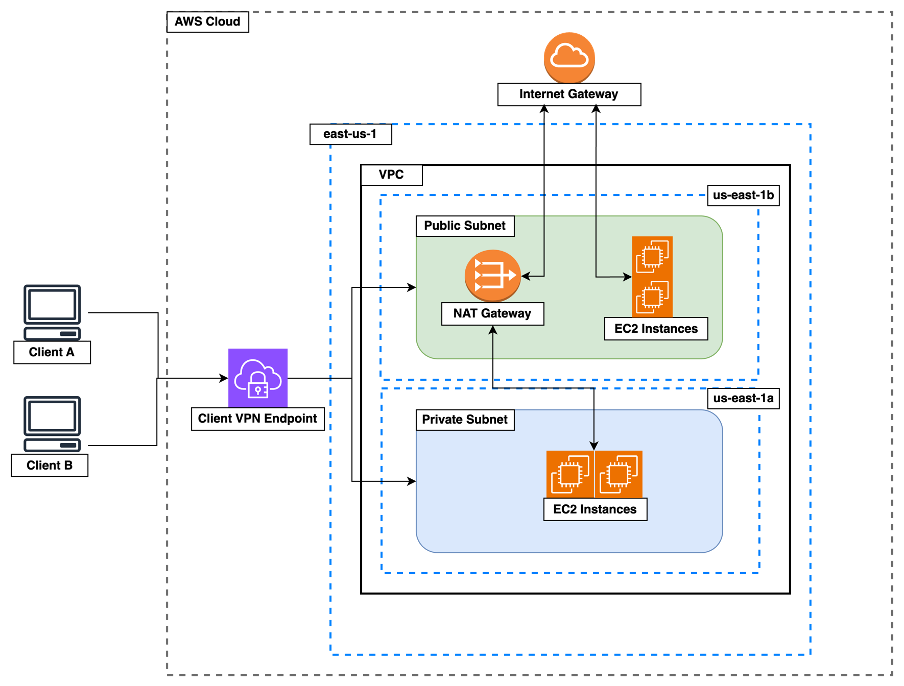

# POC Instructions

- [Overview](#overview)
- [POC Features](#poc-additional-features)
- [IaC using Terraform](#iac-using-terraform)
  - [Prep](#prep)
  - [Run](#run)
- [CaC using Ansible](#cac-using-ansible)
  - [Prep](#prep-1)
  - [Run](#run-1)

## Overview

This document contains the instructions for provisioning and configuring a simple architecture on AWS. `Terraform` is used to write the infrastructure as code whilst `Ansible` is used to configure the infrastructure that has been provisioned using Terraform.



## POC Additional Features

*IaC Features*
- A Client VPN endpoint to restrict and control access to our VPN.
- SSH through VPN to private IP addresses only
- Private subnet for additional security along with NAT gateway to allow access out from private subnet to the internet
- Support for Terraform workspaces to separate dev, staging and production environments in a single AWS account

*CaC Features*
- Virtual environment to ensure consistency
- 2 playbooks with common role
- Keep packages and software up to date using ansible

<div class="page"/>

## IaC using Terraform

The `terraform` folder contains the terraform source code to provision the infrastructure required for a web app.
It provisions a simple architecture to satisfy a POC but could easily be extended.
It comprises of the following main components:

- VPC in `us-east-1` region
- 2 Subnets (1 public, 1 private) hosted in `us-east-1a` and `us-east-1b` availability zones respectively
- An internet gateway (IGW)
- A NAT gateway to provide internet access to the private subnet resources
- An EC2 client vpn endpoint (CVPN-endpoint) to provide ssh access to the ec2 instances
- 4 EC2 instances, 2 in the public subnet and 2 in the private subnet
- 2 security groups (1 for EC2 instances and 1 for EC2 CVPN-endpoint) with ingress (inbound) and egress (outbound) rules to specify allowed traffic
- 2 route tables (1 for public subnet to route to IGW, 1 for private subnet to route to NAT gateway)

The terraform folder structure is as follows:

- terraform `project root``
-- certs `certs & keys folder, *.key ignored in .gitignore`
-- main.tf `ec2 instances`
-- networks.tf `vpc, subnets, routetables and routes`
-- providers.tf `providers configuration i.e. aws`
-- security-groups.tf `security groups, ingress, egress`
-- settings.tf `main terraform config, provider versions`
-- variables.tf `all variables, workspace specific variables`
-- vpn.tf `ec2 vpn client endpoint config, cert upload to Amazon cert manager (ACM)`

### Prep

**VPN Client endpoint**
The Client VPN endpoint uses cert based authentication. You will need to generate TLS certs and will also require a vpn client to connect.
The OpenVPN client is available for all major operating systems and is easy to use. The OpenVPN project also provide an easy-rsa utility
for creating a certificate authority with signed certs. Below are the steps to get set up quickly and easily. This project is also referenced
on the [AWS docs](https://docs.aws.amazon.com/vpn/latest/clientvpn-admin/cvpn-getting-started.html) for creating a client VPN endpoint

1. Download the relevant openvpn client for your OS: https://openvpn.net/client/
2. Clone the easy-rsa repo `git@github.com:OpenVPN/easy-rsa.git`
3. Navigate to easy-rsa/easyrsa3 folder and run below commands

```
# Initialise new pki environment
./easyrsa init-pki
# Build a new ca authority
./easyrsa build-ca # follow prompts
# Generate server cert and key
./easyrsa build-server-full server nopass
# Generate client cert and key
./easyrsa build-client-full client1.domain.tld nopass
```
<div class="page"/>

4. Copy the following generated certs and keys to the terraform/certs folder in this repo

```
pki/ca.crt
pki/issued/server.crt
pki/private/server.key
pki/issued/client1.domain.tld.crt
pki/private/client1.domain.tld.key
```

**Terraform**
Terraform will need to be installed on the machine where you will run the below steps. Most popular package managers are also supported. For more information follow steps here: https://developer.hashicorp.com/terraform/tutorials/aws-get-started/install-cli

### Run

1. Navigate to terraform directory
`cd terraform`

2. Initialise current directory for terraform use
`terraform init`

3. Create the workspaces for the 3 environments
```
terraform workspace new dev
terraform workspace new staging
terraform workspace new production
```

4. Swith to workspace of choice e.g. dev

```
terraform workspace select dev
```

5. Create terraform plan to preview changes

```
terraform plan
```

6. Execute actions in plan (without prompt)

```
terraform apply -auto-approve
```

7. Destroy all resources in the plan

```
terraform destroy
```

<div class="page"/>

## CaC using Ansible

Ansible is a configuration as code (CaC) tool. Most CaC tools will now also provide ability to manage infrastructure as code (IaC) and vice versa. The ansible folder includes two playbooks, one for configuring a webserver and one for configuring a builder. A common role is
shared by both playbooks, tasks specific for the relevant play are stored in the playbooks.

### Prep

You will need to have python3 installed on the controller from where you will run your scripts.
Most popular package managers can install python3 but it can also be downloaded directly here: https://www.python.org/downloads/


**Environment Prep**
To keep your base python3 installation clean it is a good idea to set up a virtual environment prior to installing the required
python modules. If solely working with linux vm's the `pywinrm` package is not required


1. Create a virtual environment to use with ansible (FYI you can use a virtual environment across your ansible projects or use a dedicated one per project)
`python3 -m venv ~/virtual_environments/ansible`
2. Activate the virtual environment
`. ~/virtual_environments/ansible/bin/activate`
3. Install ansible and pywinrm (update pip prior to this)

```
pip install -U pip
pip install ansible
pip install pywinrm
```


**Prepare the hosts file**
The playbook references a hosts profile. Hosts can be separated into profiles in the hosts file.
In the provided hosts file there are two profiles one for each playbook. The hosts file needs
to be updated to incllude the ip addresses of the ec2 instances you plan to configure
e.g.

```
[webservers]
# webserver1
10.0.0.20
[builders]
# builder1
10.0.0.152
```

<div class="page"/>

### Run

The playbooks can be ran using the below commands, since the standard `id_rsa` key is not being used for ssh, the private key for connecting to the ec2 instances can be passed in using `--private-key`. Inventory or hosts file can be passed in using `-i` flag, in this case the default name `hosts` is used and could be omitted.

```
# webserver
ansible-playbook -i hosts --private-key=~/.ssh/labuser.pem ./webserver-play.yml
```

```
# builder
ansible-playbook -i hosts --private-key=~/.ssh/labuser.pem ./builder-play.yml
```

